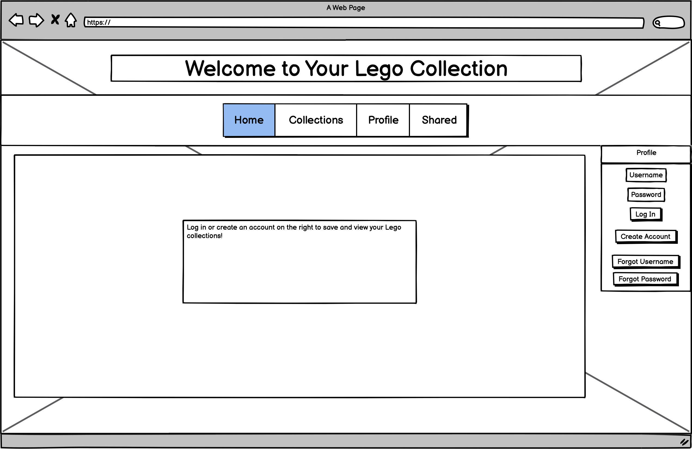
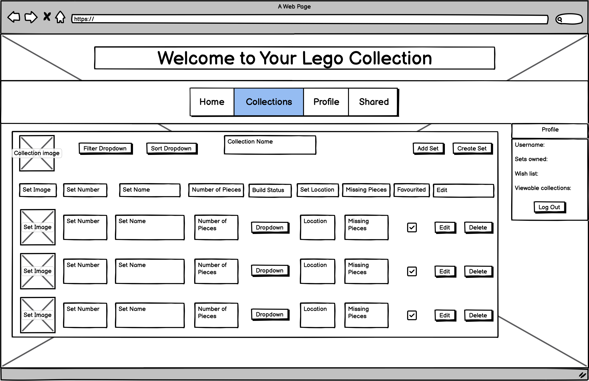
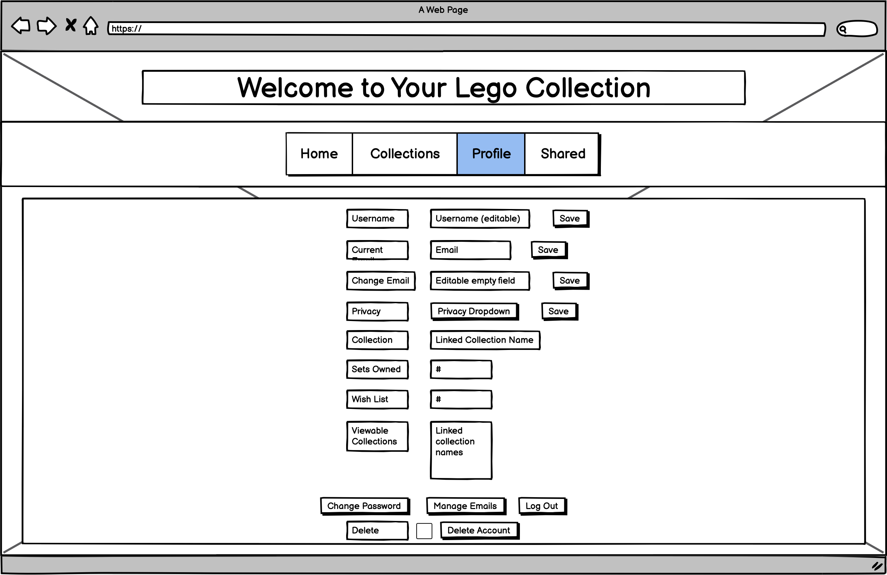
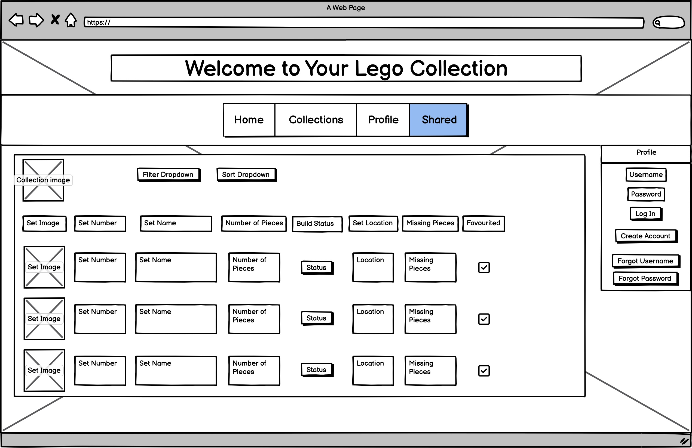
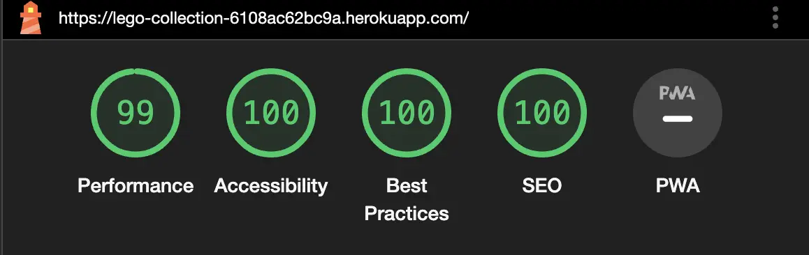
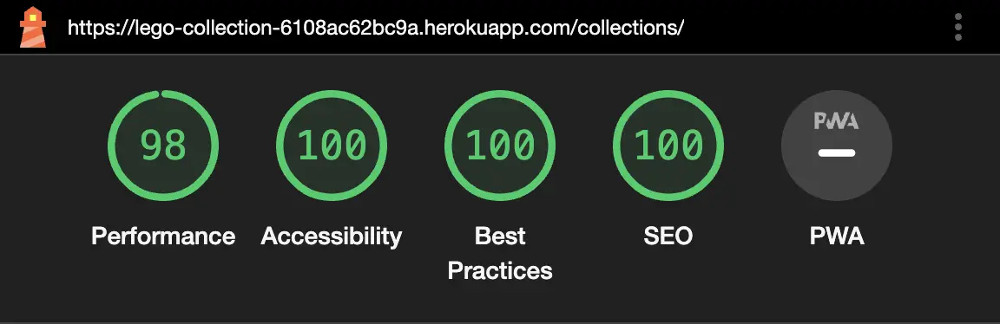
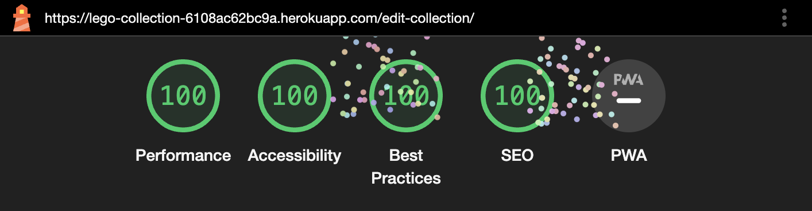
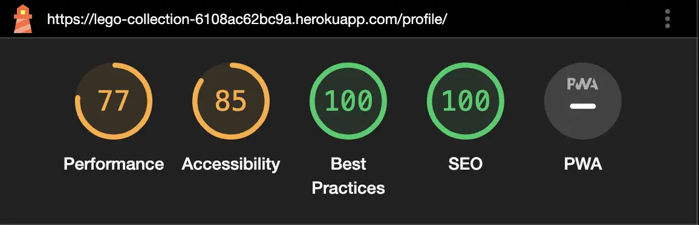
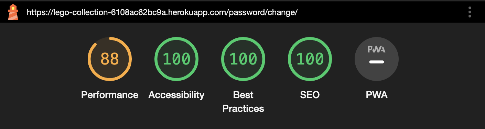
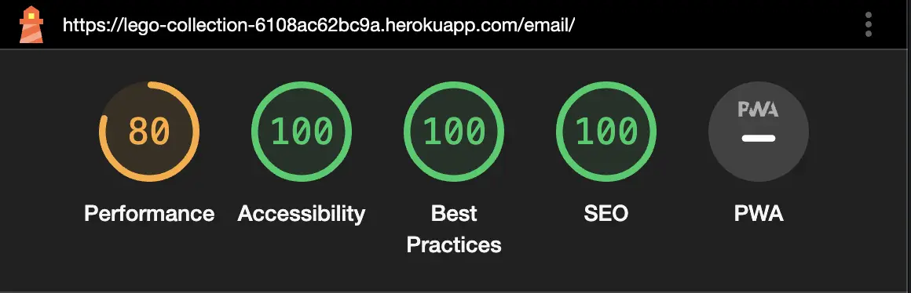

# Online Lego Collection
This site is made for avid Lego collectors! You can keep track of your sets, their status, and where they are (like your attic, or spare room). You can Favourite sets, or add sets you don't own yet to build out a wish list. But the Lego page has a wish list, you say? Unfortunately you can't share that one! While sharing features are not yet implemented on this page, they will be soon, and you can then share your entire collection, and your wish list, with friends and family (or even strangers if you like)! Your Online Lego Collection also has a field to keep track of missing pieces in your sets, when needed, and you can sort and filter your collection to be able to easily access that information and more. This is your one-stop-shop to keep track of all your sets and what's happening with them.


1. [User Experience](#user-experience)
   1. [User Stores](#user-stories)
      1. [Visitor Goals](#visitor-goals)
         1. [First-Time Visitor Goals](#first-time-visitor-goals)
         2. [Returning Visitor Goals](#returning-visitor-goals-)
         3. [Frequent Visitor Goals](#frequent-visitor-goals-)
   2. [Design](#design)
      1. [Colour Palette](#colour-palette)
      2. [Typography](#typography)
      3. [Imagery](#imagery)
   3. [Site Planning](#site-planning)
      1. [Lucidchart](#lucidchart)
      2. [Wireframes](#wireframes)
2. [Features](#features)
   1. [To Be Implemented](#to-be-implemented)
   2. [Closed Enhancements](#closed-enhancements)
3. [Technologies](#technologies)
4. [Testing](#testing)
   1. [Manual Testing](#manual-testing)
   2. [Automated Testing](#automated-testing)
   3. [Validator Testing](#validator-testing)
      1. [WAVE](#wave)
      2. [Lighthouse](#lighthouse)
      3. [PEP8](#pep8)
   4. [Bugs](#bugs)
5. [Deployment](#deployment)
   1. [Heroku](#heroku)
   2. [Droplet](#droplet)
6. [Credits](#credits)

## User Experience

### Visitor Goals

#### First-Time Visitor Goals
- As a first-time visitor to the site, I can create an account and a Lego collection to keep track of my sets.
- As a first-time visitor to the site, I can view public Lego collections, and Lego collections shared with me.*

_*Once Sharing features are enabled_

#### Returning Visitor Goals 
- As a returning visitor to the site, I can log into my account to view and edit my Lego collection.
- As a returning visitor to the site, I can manage my account, to ensure passwords, usernames, and email addresses are kept up-to-date and secure.

#### Frequent Visitor Goals 
- As a frequent visitor to the site, I can manage my Lego collection, including the build status and location for all my sets.
- As a frequent visitor to the site, I can create new Lego sets in the database, so I and others can add them to collections.
- As a frequent visitor, I can delete my Lego collection, and my account.

### User Stories
All implemented, detailed EPICs and related user stories are available in [project Issues](https://github.com/crazycooky77/ci_project4/issues?q=is%3Aissue+is%3Aclosed+-label%3Abug+-label%3Adocumentation+-label%3Awont-have+-label%3Awontfix+-label%3Aenhancement).

_insert image_

### Design

#### Colour Palette


#### Typography
2 different Google Fonts were used for the [page title](https://fonts.google.com/specimen/Londrina+Outline?query=londrina) and [website text](https://fonts.google.com/specimen/Londrina+Solid?query=londrina). They are the same font in different styles for improved design.

#### Imagery
AI-generated images were used throughout. [Stable Diffusion](https://github.com/AUTOMATIC1111/stable-diffusion-webui) and [ComfyUI](https://stable-diffusion-art.com/how-to-install-comfyui/) were used with the [Dreamshaper 8](https://civitai.com/models/4384/dreamshaper) model.

### Site Planning

#### Lucidchart
Lucidchart was used to plan out the database models.


#### Wireframes
Wireframes were used to plan out the pages for the site.

##### Homepage
Logged in:


Logged out:


#### Collections
Main page with collection - slight adjustments to buttons were made for better styling:


Main page without collections:


Add Sets - this page was split into 2 in the end. 1 page for the "Global Set Details" ("Create Set" in the final page version), and 1 page for the "Personal Set Details" ("Add Set"):


Additionally, a new view was added but not planned in wireframes for existing collections without any sets. No sort/filter buttons are shown, but instead a message advising the user to add or create a set.

#### Profile
Logged in:


Logged out:


#### Shared
Sharing features are not yet implemented. However wireframes were created to plan out the features. 

Logged in with selected collection:


Logged in without a selected collection (dropdown list for all collections the user was given access to):


Logged out (public collection link):


## Features
All features have been planned and outlined in the [Kanban board](https://github.com/users/crazycooky77/projects/1) for the project using Issues. The implemented features are available [here](https://github.com/crazycooky77/ci_project4/issues?q=is%3Aissue+is%3Aclosed+-label%3Abug+-label%3Awont-have+-label%3Awontfix+-label%3Adocumentation).

_image_

### To Be Implemented
Features not yet implemented are available in the [project's Kanban board](https://github.com/users/crazycooky77/projects/1) in the To Do and In Progress columns.

_insert image_

### Closed Enhancements
Closed enhancements can be found [here](https://github.com/crazycooky77/ci_project4/issues?q=is%3Aissue+label%3Aenhancement+is%3Aclosed). If an enhancement is labelled as "wont-have", it was not and will not be implemented.

_insert image_

## Technologies
- [Lucidchart](https://www.lucidchart.com/pages) to create the entity relationship diagram
- [Balsamiq](https://balsamiq.com/wireframes/) to plan out the pages using wireframes
- [Pycharm](https://www.jetbrains.com/pycharm/) IDE linked to GitHub to edit the project files
- [GitPod](https://gitpod.io/) when utilising Tutor Support
- [GitHub](https://github.com/) to store the code and for version-control
- [GitHub Desktop](https://desktop.github.com/) to be able to commit changes to the code without having to use the web-based tool
- [Heroku](https://heroku.com/) to deploy the app and have it available for use online
- [Python](https://www.python.org/) for project functionality
  - [Cloudinary](https://cloudinary.com/documentation/django_integration) for image upload and management
  - [Coverage](https://coverage.readthedocs.io/en/7.4.1/) ???
  - [dj-database-url](https://pypi.org/project/dj-database-url/) for easier database configuration
  - [django-allauth](https://docs.allauth.org/en/latest/) for user creation, authentication, and management
  - [Django-Select2](https://django-select2.readthedocs.io/en/latest/) to enable database searching within a dropdown
  - [Gunicorn](https://gunicorn.org/) ???
  - [Pillow](https://pypi.org/project/pillow/) for image processing
  - [Whitenoise](https://whitenoise.readthedocs.io/en/latest/) for static files
- [JavaScript](https://www.javascript.com/) for site functions
- [HTML](https://html.spec.whatwg.org/) for the templates for each of the pages for the site
- [CSS](https://www.w3.org/Style/CSS/Overview.en.html) for page styling
- [Django](https://www.djangoproject.com/) was used as the Python framework for the project
- [PostgreSQL](https://www.postgresql.org/) as the database for local development
- [ElephantSQL](https://www.elephantsql.com/) as the database for the live web app
- [Favicon](https://favicon.io/) to generate the page's Favicon
- [Flexbox](https://css-tricks.com/snippets/css/a-guide-to-flexbox/) for CSS styling
- [Unicorn Revealer](https://chromewebstore.google.com/detail/unicorn-revealer/lmlkphhdlngaicolpmaakfmhplagoaln?hl=en-GB) for CSS debugging
- [Wave](https://wave.webaim.org/extension/) for accessibility checks

## Testing

### Manual Testing
Responsiveness (screen pixel width), different browsers and devices_

### Automated Testing

### Validator Testing
_http://eightshapes.com/_

#### HTML
_https://validator.w3.org/#validate_by_input_

#### CSS
_https://jigsaw.w3.org/css-validator/#validate_by_input_

#### JSHint
_https://jshint.com/_

#### PEP8

_https://pep8ci.herokuapp.com/_

#### WAVE
All pages were checked with WAVE. There are some Alerts, however nothing unexpected. Some Errors are logged on the Edit Collection, Profile, Change Password, and Manage Emails pages. These errors are due to missing labels for form fields from Django forms.

#### Lighthouse
Lighthouse was run on all pages for the site and issues identified were resolved, where possible.

- Images were all converted from png to webp
- Missing meta header details were added
- JavaScript console errors resolved

Cumulative Layout Shifts caused a lower score in Performance for the pages listed below. This was deemed acceptable, to enable better responsiveness and dynamic resizing.
- Create Collection
- Create Set
- Profile page
- Change password
- Change email

Accessibility issues were noted on some pages, due to automatically rendered Django forms:
- Add Set
  - ARIA input fields without accessible names (from Django Select2)
- Collections page with sets
  - Missing labels noted, but labels are present (though hidden). Text is still provided for these fields
- Edit Collection
  - Form/select/input fields are missing labels, from Django forms
- Profile
  - Form/select/input fields are missing labels, from Django forms

Best Practice and SEO issues:
- Collections page with sets
  - User-entered images are provided with low resolution and incorrect aspect ratios (this is a conscious choice to keep the table layout styled accordingly)
  - Hamburger links are not crawlable, however they are formatted as normal links
- Edit Collection
  - User-entered images are provided with low resolution and incorrect aspect ratios (this is a conscious choice to keep the table layout styled accordingly)


Homepage


Collections page without collections


Create Collection


Collections page with collection but no sets


Create Set


Add Set


Collections page with sets


Edit Collection


Profile page


Change password


Change email


Shared page


### Bugs
Known bugs are all listed in the [project's Issues](https://github.com/crazycooky77/ci_project4/issues?q=is%3Aopen+is%3Aissue+label%3Abug) with the label "bug". The current list can also be viewed below.

_Insert image_

Fixed bugs can also be found in the [project's Issues](https://github.com/crazycooky77/ci_project4/issues?q=is%3Aissue+label%3Abug+is%3Aclosed).

_Insert image_

## Deployment
The site was deployed on both Heroku and using a [Digital Ocean](https://www.digitalocean.com/) Droplet. This was to keep the site live after the project submission, and due to networking issues caused by Heroku (see [this bug](https://github.com/crazycooky77/ci_project4/issues/44) for additional details).

### Heroku
For Heroku, the following steps were used for deployment:
1. Cloned the basic repository from [Code Institute](https://github.com/Code-Institute-Org/ci-full-template)
   1. Code > Open with GitHub Desktop
2. Created new repository in [own GitHub](https://github.com/crazycooky77/ci_project4) for the cloned repository
3. Created new app on [Heroku](https://dashboard.heroku.com/apps)
   1. New > Create new app
   2. Provide app name and select region > Create app
4. Linked Heroku to cloned GitHub repository
   1. Click GitHub in the Deployment method section
   2. Log into GitHub, provide access to Heroku, and type in the repository name
   3. Search
   4. Connect
5. Enabled automatic deploys
   1. Tick the box for Automatic deploys in the corresponding section
6. Added python buildpack in the Settings > Buildpacks section
7. Added necessary Config Vars

### Droplet
To deploy the project using a Digital Ocean Droplet, these steps were followed:
1. In your settings.py in GitHub for ALLOWED_HOSTS and CSRF_TRUSTED_ORIGINS:
   1. Ensure "localhost" and "https://localhost" are added
   2. Add environment variables for your DROPLET_IP and your public domain name (if applicable)
2. Create Droplet in Digital Ocean project
   1. Select the nearest Datacenter and preferred OS
   2. Leave Droplet Type as Basic (Shared CPU)
   3. Select Regular > $4/mo CPU options (choose a more expensive plan if desired)
   4. Select the Authentication Method
   5. Enter the name for your Droplet (or use the default one provided)
   6. Create Droplet
   7. Click "Enable now" for Reserved IP within the Droplet
   8. Click "Assign Reserved IP"
      1. If you have a public domain name you want to use, ensure you add your reserved Droplet IP to your URL forwarding
   9. Within Networking > Firewalls, "Create Firewall"
      1. Enter a name for your firewall
      2. New rule under SSH
         1. HTTP
      3. New rule under SSH
         1. HTTPS
      4. Search for your Droplet name under Apply to Droplets
      5. "Create Firewall"
3. Open the Droplet Console and clone your GitHub repository with the Django project
   1. In the GitHub repository, click Code and copy the HTTPS link
   2. In the Droplet console: ```git clone <HTTPS_LINK>```
4. Update and install the necessary packages via the console
   1. ```sudo apt-get update```
   2. ```sudo apt-get dist-upgrade```
   3. ```sudo reboot```
   4. ```apt install python3-pip python3.11-venv nginx``` (replace with your python version as needed)
   5. ```sudo snap install core; sudo snap refresh core```
   6. ```sudo snap install --classic certbot```
   7. ```cd <CLONED_GITHUB_PROJECT_FOLDER>```
   8. If you have/need a .env file, you can copy it via your local machine's console using:
      1. ```scp LOCAL_FOLDER/.env DROPLET_USER@DROPLET_IP:/root/DROPLET_DIRECTORY```
      2. Remember to add your environment variables for your Droplet IP and public domain name (if applicable)
   9. ```python3 -m venv .venv```
   10. ```source .venv/bin/activate```
   11. ```python3 -m pip install -r requirements.txt```
   12. ```deactivate```
5. Some files on the Droplet now need to be edited, and services enabled and started, so that your site will constantly run without having to manually runserver
   1. In your Droplet's console: ```vi /etc/systemd/system/gunicorn.socket```
   2. ```i``` (for "insert")
   3. Paste:
    ```
    [Unit]
    Description=gunicorn socket
    
    [Socket]
    ListenStream=/run/gunicorn.sock
    
    [Install]
    WantedBy=sockets.target
    ```
   4. Press the Escape key
   5. Type: ```:wq``` and press Enter ("write quit")
   6. ```vi /etc/systemd/system/gunicorn.service```
   7. ```i```
   8. Paste:
   ```
    [Unit]
    Description=gunicorn daemon
    Requires=gunicorn.socket
    After=network.target
    
    [Service]
    User=root
    Group=www-data
    WorkingDirectory=/root/<GITHUB_PROJECT_FOLDER>
    EnvironmentFile=/root/<GITHUB_PROJECT_FOLDER>/.env
    ExecStart=/root/<GITHUB_PROJECT_FOLDER>/.venv/bin/gunicorn \
              --access-logfile - \
              --workers 1 \
              --timeout 120 \
              --bind unix:/run/gunicorn.sock \
              <DJANGO_PROJECT_NAME>.wsgi:application
    
    [Install]
    WantedBy=multi-user.target
    ```
   9. Escape key
   10. ```:wq``` and Enter
   11. ```vi /etc/nginx/sites-available/<GITHUB_PROJECT_FOLDER>```
   12. ```i```
   13. Paste:
   ```
    server {
        listen 80;
        server_name <PUBLIC_DOMAIN_NAME>;

        location = /favicon.ico { access_log off; log_not_found off; }
        location /<STATIC_ROOT_FOLDER_FROM_SETTINGS_PY>/ {
            root /root/<GITHUB_PROJECT_FOLDER>>;
        }

        location / {
            include proxy_params;
            proxy_pass http://unix:/run/gunicorn.sock;
        }
    }
    ```
   14. Escape key
   15. ```:wq``` and Enter
   16. ```systemctl enable gunicorn.socket```
   17. ```systemctl enable gunicorn.service```
   18. ```systemctl start gunicorn.service```
   19. ```systemctl start gunicorn.socket```
   20. ```vi /etc/nginx/nginx.conf```
   21. Use your arrow key to move your text cursor to the empty line above "sendfile on;"
   22. ```o```
   23. ```client_max_body_size 10M;``` (change 10M to a larger number if you want to allow larger file sizes)
   24. Escape key
   25. ```:wq``` and Enter
   26. ```sudo ln -s /etc/nginx/sites-available/<GITHUB_FOLDER> /etc/nginx/sites-enabled```
   27. ```nginx -t```
       1. You want to see a "test is successful" here to ensure the previous steps were correctly followed and without typos
6. Adjust settings as below to enable encryption on your webpage via letsencrypt. This only works if you own the domain yourself and is automatically renewed every 90 days.
   1. ```sudo ln -s /snap/bin/certbot /usr/bin/certbot```
   2. ```certbot --nginx -d <YOUR_PUBLIC_DOMAIN_NAME>```
      1. Enter an email address, as required by the console
      2. ```Y``` to agree to terms of service
      3. ```N``` to decline sharing your email address
   3. ```sudo systemctl restart nginx```


## Credits
The base template was cloned from the [Code Institute GitHub repository](https://github.com/Code-Institute-Org/ci-full-template). Various other resources were used for different features. They are all listed below, categorised accordingly. Special thanks to [my husband](https://twitter.com/fbuechsel) who helped with troubleshooting and figuring out the Droplet setup, and [my mentor](https://github.com/CluelessBiker) for her various resources and constant reminders to document **everything**.

#### CustomUser Documentation
- [Django authentication](https://docs.djangoproject.com/en/5.0/topics/auth/default/)
- [CustomUser model usage](https://docs.djangoproject.com/en/3.2/topics/auth/customizing/#substituting-a-custom-user-model)
- [CustomUser user management](https://reintech.io/blog/creating-a-custom-user-management-system-in-django)
- [Choices fields in models](https://docs.djangoproject.com/en/3.1/ref/models/fields/#field-choices-enum-subclassing)

#### CSS
- [Rainbow gradient](https://stackoverflow.com/questions/40557461/rainbow-gradient-on-text-in-css)

#### Custom Form Messages
- [Custom invalid login messages](https://stackoverflow.com/questions/47923952/python-django-how-to-display-error-messages-on-invalid-login)
- [Custom form errors](https://stackoverflow.com/questions/24273839/django-allauth-custom-login-does-not-show-errors)

#### Account Management
- [Django introduction](https://docs.djangoproject.com/en/4.0/intro/tutorial03/)
- [Custom login view](https://stackoverflow.com/questions/75401759/how-to-set-up-login-view-in-python-django)
- [Remove intermediate logout page](https://stackoverflow.com/questions/18134807/how-to-disable-intermediate-signout-page-in-django-allauth)
- [Allauth account templates (to assist in template customisation)](https://github.com/pennersr/django-allauth/tree/main/allauth/templates/account)
- [Updating user profiles](https://dev.to/earthcomfy/django-update-user-profile-33ho)
- [User-led account deletion](https://stackoverflow.com/questions/38047408/how-to-allow-user-to-delete-account-in-django-allauth)

#### Collection Sort, Filter, Edit
- [Assign values to objects for inserting into database (collection owner from collection model for lego_collection model)](https://forum.djangoproject.com/t/automatically-get-user-id-to-assignate-to-form-when-submitting/5333/7)
- [Javascript redirect bugfix for sorting and filtering](https://stackoverflow.com/questions/8898998/window-location-replace-not-working-to-redirect-browser)
- [Edit multiple objects at once (for sets in collections)](https://collingrady.wordpress.com/2008/02/18/editing-multiple-objects-in-django-with-newforms/)
- [Cascading dropdowns for filter](https://www.w3schools.com/howto/howto_js_cascading_dropdown.asp)

#### Collection Mobile View
- [HTML select option checkboxes](https://stackoverflow.com/questions/17714705/how-to-use-checkbox-inside-select-option)
- [Display column based on checkboxes](https://stackoverflow.com/questions/60344393/how-to-display-hide-columns-when-checkboxes-are-checked)
- [Hide columns based on checkboxes](https://www.sitepoint.com/community/t/hide-table-column-whose-checkbox-is-not-checked-on-page-load/242783)

#### Droplet Setup
- [Update Kernel](https://docs.digitalocean.com/products/droplets/how-to/kernel/upgrade/)
- [Installing requirements](https://stackoverflow.com/questions/75602063/pip-install-r-requirements-txt-is-failing-this-environment-is-externally-mana)
- [Setup instructions](https://www.digitalocean.com/community/tutorials/how-to-set-up-django-with-postgres-nginx-and-gunicorn-on-ubuntu-22-04)
- [Error fix for file upload](https://www.cyberciti.biz/faq/linux-unix-bsd-nginx-413-request-entity-too-large/)
- [Encrypting pages](https://www.digitalocean.com/community/tutorials/how-to-secure-nginx-with-let-s-encrypt-on-ubuntu-22-04)